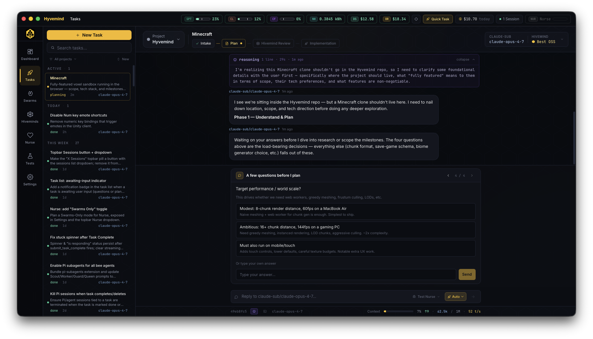

<div align="center">
  

  # Hyvemind

  **an OSS desktop app for multi-model AI dev.**

  Plan‑building Task conversations · Multi‑model code review · Self‑healing autonomous Swarms

  [](https://github.com/Unravl/Hyvemind/actions/workflows/ci.yml)
  [](https://github.com/Unravl/Hyvemind/actions/workflows/build.yml)
  [](https://github.com/Unravl/Hyvemind/actions/workflows/audit.yml)
  [](LICENSE)
  [](https://github.com/Unravl/Hyvemind/releases)
  [](https://tauri.app)
  [](https://www.rust-lang.org)
  [](https://discord.gg/nBrhBjp686)
</div>

---

> [!WARNING]
> **Hyvemind is in alpha.** It is being shared with friends and early testers.

<p align="center">
  
</p>

## What is Hyvemind?

Hyvemind is a desktop app that combines **three modes** of AI‑assisted development in a single GUI:

### 🐝 Tasks
A focused conversational interface for **building a plan**. Every Task is a back‑and‑forth with an AI model of your choice, that ends in a workable plan you can hand off to an agent that will implement it, OR to a Hivemind which will strengthen the plan before implementation.

### 🐝 Hivemind
A concurrent **multi‑model review engine**. You define a team of LLMs and rounds. Each round runs N models in parallel against the same prompt that an Orchestrator puts together — based on the original plan, gathered source context, and rules. Outputs from a round are merged and fed into the next round, producing *iterative refinement*.

The Orchestrator will also score the hivemind reviewers and display the findings for you to get a personal feel of how well models do.

### 🐝 Swarms
**Fully autonomous multi‑feature execution**. Hand the swarm a goal and a working directory; it runs until the work is done — Queen decomposes, Scouts plan, Workers implement, Guards validate, Nurse keeps it alive when things stall. Best of all, Hiveminds can be invoked at the Queen and Scout level. Swarm plans can be exported, cloned and used against different model compositions!

## Why Hyvemind?

The combination is the moat. No single feature here is unique on its own — but no other
product brings them all together at this quality bar.

| Differentiator | Why it matters |
|---|---|
| **Self‑healing autonomy via Nurse** | Other "leave‑it‑running" agents die on the first stall. Nurse runs seven detectors over every long‑running session and routes each signal through a three‑tier pipeline (deterministic → templated playbook → LLM classifier), so most interventions never even spend tokens. |
| **Polished multi‑model review** | Adversarial stance forces reviewers to find flaws. Cross‑round merge produces iteration, not just N opinions. |
| **Full pipeline integrated** | Tasks, multi‑model review, and autonomous swarms in one product, with shared cost tracking and a unified UI. |
| **Built like real infrastructure** | Circuit breakers, semaphore‑bounded concurrency, atomic file writes, OS‑keychain secrets, append‑only progress logs, crash‑safe state. |
| **Premium boutique craft** | The bar is *Linear / Arc / Raycast* — opinionated, polished, feels expensive in a good way. |

## The Bee Colony

Every agent in Hyvemind maps to a real role in a bee colony. This is intentional. Each
agent has its own system prompt and a specific thinking level.

| Agent | Role | Thinking | What it does |
|---|---|---|---|
| **Queen** | Orchestrator | Medium | Decomposes the goal into features + dependencies + milestones. Runs the swarm loop. |
| **Scout** | Planner | High | Analyses the codebase per‑feature, produces an implementation plan, complexity, risks. |
| **Worker** | Implementer | Medium | Writes the actual code following the Scout's plan. Emits a structured handoff JSON on completion. |
| **Guard** | Validator | Medium | Validates milestone assertions. On failure, synthesises a fix‑feature (max 3 retries). |
| **Nurse** | Heartbeat | Low (Tier 3 only) | Push‑mode supervisor for every long‑running session. Seven detectors (stall, reasoning loop, tool failure, process health, provider health, context saturation, retry exhaustion) feed a three‑tier dispatcher (deterministic action → templated playbook → LLM classifier). Decisions: **LeaveIt / Steer / Restart / Cancel** with mandatory kill verification. Every decision is logged to `~/.hyvemind/debug/nurse/` regardless of debug mode. |

## Quickstart

### Prerequisites

- **macOS** primary (Intel + Apple Silicon). Linux & Windows builds are produced by CI but
  are not actively tested.
- **Rust** (stable) — install via [rustup](https://rustup.rs/)
- **Node.js 20+** & **npm**
- **Bun** — for compiling the bundled Pi runtime
  (`curl -fsSL https://bun.sh/install | bash`)
- An API key for at least one provider: Anthropic, OpenAI, OpenRouter, or one of the other providers we offer (see [providers](#llm-providers) below).

### Run from source

```bash
git clone https://github.com/Unravl/Hyvemind.git
cd Hyvemind/app
npm install
npm run tauri:dev
```

The first launch triggers a one-time Pi build (see [First run](#first-run) below).
On first run, open **Settings** to add your provider API keys — they're stored in your OS
keychain, never on disk in plaintext.

### Install a release

Download the latest installer for your platform from
[Releases](https://github.com/Unravl/Hyvemind/releases). Bundles are not yet code‑signed,
so on macOS you'll need to right‑click the app → **Open** the first time to bypass
Gatekeeper. Notarisation is on the roadmap.

### First run

The first `npm run tauri:dev` (or `tauri:build`) triggers `scripts/build-pi.sh`, which:

1. Downloads the pinned version of [Pi](https://github.com/badlogic/pi-mono)
   (`@earendil-works/pi-coding-agent`) via `bun`
2. Downloads Pi's bundled npm extensions (`pi-web-access`, `pi-subagents`,
   `pi-mcp-adapter`) plus the two local Hyvemind extensions
   (`hyvemind-providers`, `hyvemind-handoff` from `app/src-tauri/pi-extensions/`)
3. Compiles Pi into a single executable via `bun build --compile`

This step can take **2–5 minutes** on a first run — bun is downloading and compiling a
substantial TypeScript project with all its dependencies. The terminal will show
`prepare-pi` with no progress bar during this time.

The build writes a stamp file at `app/src-tauri/binaries/.pi-version`. As long as the
pinned Pi version in `scripts/pi-version.txt` hasn't changed, every subsequent
`tauri:dev` skips the build entirely — the stamp check costs milliseconds. To force a
rebuild (e.g. when upgrading Pi), bump the version string in `scripts/pi-version.txt`.

## Tech Stack

- **Shell** — [Tauri 2](https://tauri.app/) (Mac primary; Linux/Windows experimental)
- **Frontend** — React 18, Vite, TypeScript, Tailwind CSS, Vitest
- **Backend** — Rust (tokio, sqlx, reqwest, moka, keyring, tracing, sentry)
- **Agent runtime** — [Pi](https://github.com/badlogic/pi-mono) by Mario Zechner /
  earendil‑works, bundled and pinned (see `scripts/pi-version.txt`)
- **LLM providers** — Anthropic API, OpenAI API, Claude Subscription, ChatGPT Subscription,
  OpenRouter, OpenCode Go, CROF, Ollama, NeuralWatt, DeepSeek API, Xiaomi Mimo API,
  z.ai (GLM), NVIDIA NIM — and any OpenAI Completions compatible API. All behind
  per‑provider circuit breakers and a shared response cache

Architecture details live in [`CLAUDE.md`](CLAUDE.md). Product reference lives in
[`PRODUCT.md`](PRODUCT.md).

## Documentation

Topical deep-dives live under [`docs/`](docs/). Start with [`docs/README.md`](docs/README.md)
for the full index. Highlights:

- [`docs/architecture.md`](docs/architecture.md) — system component map + sequence diagrams
- [`docs/frontend-architecture.md`](docs/frontend-architecture.md) — React shell, provider tree, IPC layer
- [`docs/bee-agents.md`](docs/bee-agents.md) — per-agent deep-dive (Queen / Scout / Worker / Guard / Nurse)
- [`docs/ipc-reference.md`](docs/ipc-reference.md) — per-command Tauri IPC reference
- [`docs/providers.md`](docs/providers.md) — LLM provider abstraction
- [`docs/extension-authoring.md`](docs/extension-authoring.md) — Rust pollers, Pi extensions, topbar widgets
- [`docs/developer-cookbook.md`](docs/developer-cookbook.md) — task-oriented recipes


## Contributing

PRs welcome — please read [`CONTRIBUTING.md`](CONTRIBUTING.md) first. By participating
you agree to abide by the [Code of Conduct](CODE_OF_CONDUCT.md).

For deep‑dive architecture (file paths, IPC surface, debug commands, investigation
guides), see [`CLAUDE.md`](CLAUDE.md).

## Security

Found a security issue? Please **don't** open a public issue. See
[`SECURITY.md`](SECURITY.md) for the disclosure process.

## Acknowledgements

Hyvemind is built on top of **[Pi](https://github.com/badlogic/pi-mono)**
(`@earendil-works/pi-coding-agent`) by Mario Zechner / earendil‑works. Pi provides the
underlying agentic runtime; Hyvemind layers Queen / Scout / Worker / Guard / Nurse
orchestration, multi‑model review, cost tracking, and persistence on top. Pi is bundled
inside Hyvemind at a pinned version — users never install it themselves.

## License

[MIT](LICENSE) © 2026 Hayden Evan
