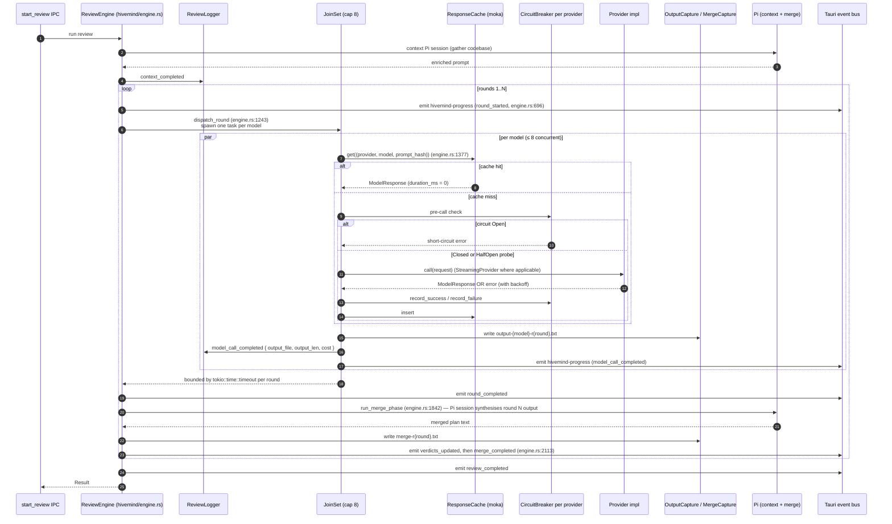
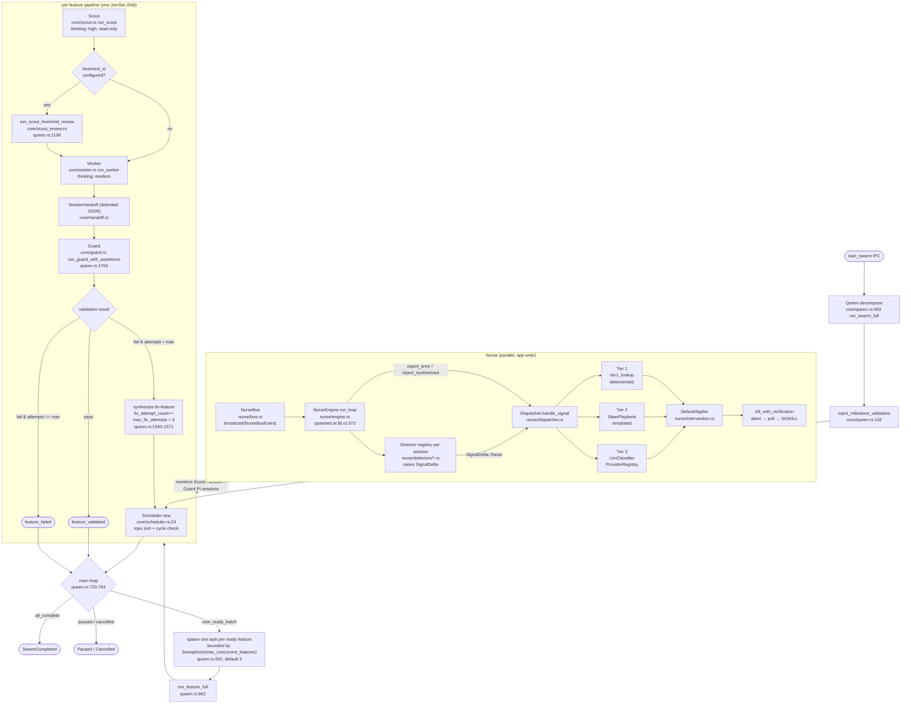
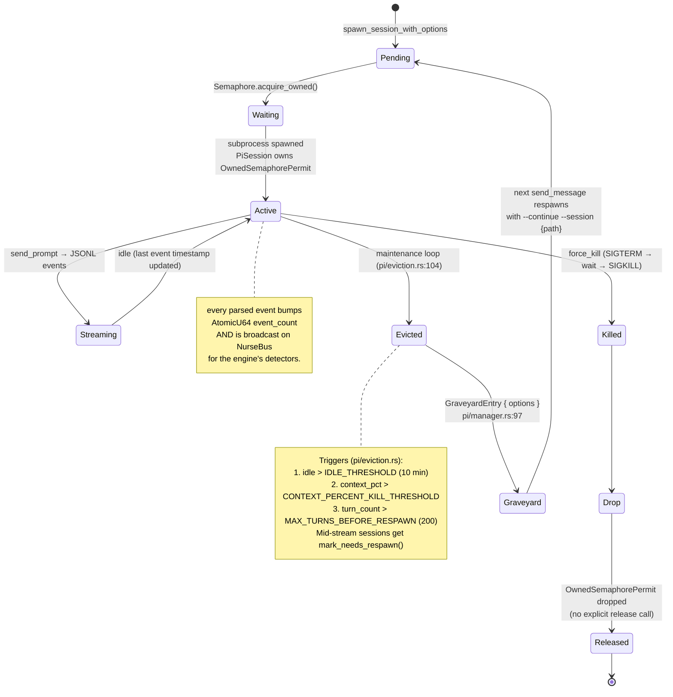
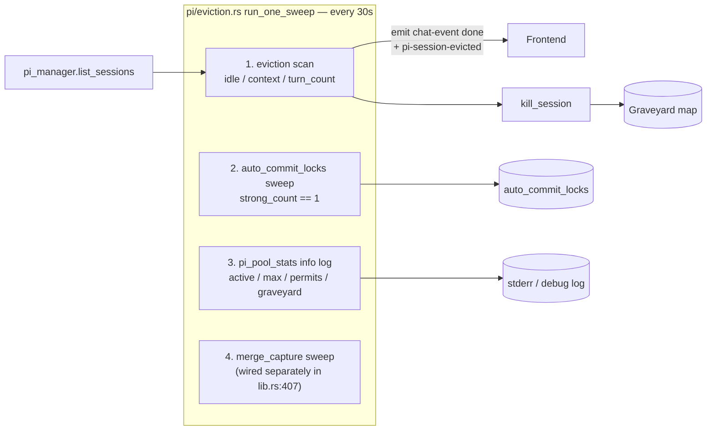
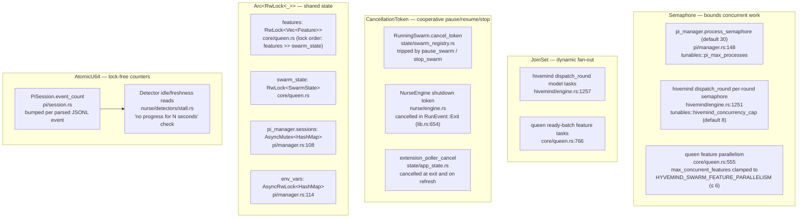

# Hyvemind Architecture & Sequence Flows

> Companion to [`CLAUDE.md`](../CLAUDE.md) (technical reference) and
> [`PRODUCT.md`](../PRODUCT.md) (product context). This document visualises
> the same systems with Mermaid diagrams plus inline captions citing
> `file:line` so a contributor can land on the exact source.
>
> Everything here renders on GitHub. Diagrams use Mermaid; one section
> (the storage tree) uses ASCII because Mermaid cannot express it.
>
> When a flow in this doc drifts from the code, the code wins — fix the
> diagram in the same commit. The
> [`CLAUDE.md` Documentation Maintenance trigger tables](../CLAUDE.md#documentation-maintenance)
> tell you which other docs also need an edit.

## Contents

1. [System component map](#1-system-component-map)
2. [Tasks lifecycle (send_message)](#2-tasks-lifecycle-send_message)
3. [Hivemind round flow](#3-hivemind-round-flow)
4. [Swarm integrated loop](#4-swarm-integrated-loop)
5. [Pi process pool](#5-pi-process-pool)
6. [Crash recovery on startup](#6-crash-recovery-on-startup)
7. [Storage layout (ASCII)](#7-storage-layout-ascii)
8. [Concurrency primitives map](#8-concurrency-primitives-map)

---

## 1. System component map

```mermaid
flowchart LR
    subgraph Frontend["Frontend (React 18 + Vite, WebView)"]
        UI["Screens<br/>Dashboard / Tasks / Swarms /<br/>Hiveminds / Tests / Settings"]
        IPC_CLI["lib/ipc.ts<br/>invoke&lt;T&gt; / listen"]
        EVENTSTORE["Singleton event stores<br/>hivemindEventStore<br/>swarmActivityStore"]
    end

    subgraph Tauri["Tauri 2 shell (lib.rs)"]
        SETUP["setup hook<br/>lib.rs:229"]
        HANDLER["invoke_handler!<br/>lib.rs:543"]
        EXIT["RunEvent::Exit<br/>lib.rs:650"]
    end

    subgraph AppState["AppState (state/app_state.rs)"]
        CFG["Config + SecretStore"]
        STORES["SwarmStore / HivemindStore<br/>UsageStore / ActivityWriter"]
        REGISTRIES["SwarmRegistry<br/>ProviderRegistry<br/>ExtensionRegistry"]
        CACHE["ResponseCache (moka)"]
        LOCKS["auto_commit_locks<br/>extension_refresh_locks"]
    end

    subgraph Subsystems["Subsystems"]
        CHAT["commands/chat.rs<br/>Tasks-view conversations"]
        HIVEMIND["hivemind/engine.rs<br/>multi-model review"]
        CORE["core/{queen,scout,worker,guard}.rs<br/>swarm execution"]
        NURSE["nurse/{engine,dispatcher,intervention}.rs<br/>stall + recovery"]
    end

    subgraph PiLayer["Pi runtime"]
        MANAGER["PiManager<br/>pi/manager.rs"]
        SEM(("Semaphore<br/>default 30"))
        SESSIONS["PiSession (Arc) × N<br/>pi/session.rs"]
        BIN["pi-&lt;target-triple&gt;<br/>JSONL RPC subprocess"]
    end

    subgraph Providers["providers/mod.rs"]
        ANTH["AnthropicProvider"]
        OAI["OpenAICompatibleProvider"]
        OR["OpenRouterProvider"]
        PIS["PiSubscriptionProvider"]
        MOCK["MockProvider"]
    end

    UI -- "invoke()" --> IPC_CLI
    IPC_CLI -- "Tauri IPC" --> HANDLER
    HANDLER --> CHAT
    HANDLER --> HIVEMIND
    HANDLER --> CORE
    HANDLER --> NURSE
    SETUP --> AppState
    AppState --> CHAT
    AppState --> HIVEMIND
    AppState --> CORE
    AppState --> NURSE
    CHAT --> MANAGER
    CORE --> MANAGER
    HIVEMIND --> MANAGER
    HIVEMIND --> Providers
    CORE -. "context / merge sessions" .-> Providers
    NURSE -. "Tier 3 classifier" .-> Providers
    MANAGER -- "PiEvent → NurseBus" --> NURSE
    MANAGER --> SEM
    MANAGER --> SESSIONS
    SESSIONS --> BIN

    CHAT -- "emit chat-event" --> EVENTSTORE
    HIVEMIND -- "emit hivemind-progress" --> EVENTSTORE
    CORE -- "emit swarm-event / swarm-activity" --> EVENTSTORE
    NURSE -- "emit nurse-event" --> EVENTSTORE
    EVENTSTORE -- "fan-out" --> UI

    classDef ext fill:#1A1E2A,stroke:#F5B919,color:#fff
    class BIN ext
```



**Caption.** Every IPC command is registered in
`lib.rs:543-647` (`invoke_handler!`) and dispatched to a thin
`commands/*.rs` delegator that reaches into `AppState` (built at
`state/app_state.rs:183`). The four subsystems —
`chat` (`commands/chat.rs`), `hivemind/engine.rs:1`, the bee-colony
agents under `core/{queen,scout,worker,guard}.rs`, and the
push-mode `nurse/` engine — all share one `PiManager`
(`pi/manager.rs:104`) governed by a single `Semaphore` (default 30,
configurable via `HYVEMIND_PI_MAX_PROCESSES` in
`tunables::pi_max_processes`). All LLM traffic flows through the
`Provider` trait (`providers/provider_trait.rs`) and never out of the
WebView — the renderer talks only to `lib/ipc.ts` and listens via
singleton stores (`lib/hivemindEventStore.ts`, `lib/swarmActivityStore.ts`).
`PiManager` fans every parsed Pi event onto a `NurseBus`
(`nurse/bus.rs`) that the engine subscribes to once; chat / swarm /
hivemind error paths call `engine.report_error` / `report_synthesized`
directly without ever polling. On exit (`lib.rs:650`) the Nurse,
extension pollers, and Pi subprocesses are torn down with bounded
timeouts.

---

## 2. Tasks lifecycle (send_message)

```mermaid
sequenceDiagram
    autonumber
    participant U as User
    participant FE as Frontend (Tasks.tsx)
    participant RT as TaskRuntimeProvider
    participant IPC as commands/chat.rs
    participant PM as PiManager
    participant SEM as Semaphore (default 30)
    participant SES as PiSession
    participant PI as Pi subprocess
    participant BUS as Tauri event bus

    U->>FE: types prompt, hits send
    FE->>IPC: invoke("send_message", { session_id, text, ... })
    IPC->>PM: get_session(session_id)
    alt warm: session exists in PiManager.sessions
        PM-->>IPC: Arc&lt;PiSession&gt;
    else cold: not in pool
        IPC->>PM: spawn_session_with_options (commands/chat.rs:600)
        PM->>SEM: acquire_owned() (pi/manager.rs)
        SEM-->>PM: OwnedSemaphorePermit
        PM->>PI: bun-compiled pi-&lt;target-triple&gt; --mode rpc
        PI-->>PM: ready
        PM->>SES: wrap(child, permit) (pi/session.rs)
        SES-->>IPC: Arc&lt;PiSession&gt;
    end
    IPC->>SES: send_prompt(text, tools, thinking_level)
    SES->>PI: JSONL write to stdin
    loop streaming
        PI-->>SES: JSONL event on stdout
        SES->>SES: bump event_count (AtomicU64)
        SES->>BUS: PiEventBatcher (pi/events.rs)<br/>coalesce 100ms / 50 tokens
        BUS-->>FE: emit("chat-event", { event_type: "chunk" | "tool" | ... })
        FE->>RT: reduce + render
    end
    PI-->>SES: messageStop / done
    SES->>BUS: emit("chat-event", { event_type: "done" })
    BUS-->>FE: terminal event
    IPC-->>FE: Result&lt;(), IpcError&gt;
```

**Caption.** The warm path skips the Semaphore acquire entirely because
`PiManager` keeps the session in its `sessions` map. Cold paths take an
`OwnedSemaphorePermit` from the global Semaphore (`pi/manager.rs:148`);
the permit lives inside the `PiSession` (`pi/session.rs`) and is
released by `Drop` — there is no separate release call. Pi events
arrive as strict LF-delimited JSONL on stdout; each parsed event bumps
the session activity counters and is fanned out to the `NurseBus`
(`nurse/bus.rs`) so the Nurse engine's detectors can run as push
consumers rather than polling. A separate Nurse-relevant activity
counter ignores `SessionStats` and `Heartbeat` instrumentation; the
watchdog and batched Nurse LLM reviewer use that watermark so model
calls only happen after real Pi activity changed. Streaming output is
coalesced through
`PiEventBatcher` (`pi/events.rs`) at 100 ms / 50 tokens before
crossing the IPC bridge so the frontend isn't flooded. The first
message after opening Tasks pays the 1-2 s Pi cold-start; subsequent
messages reuse the warm session until the maintenance loop
(`pi/eviction.rs:104`) reclaims it after the 10-minute idle TTL.

---

## 3. Hivemind round flow



**Caption.** The engine drives N rounds in series; each round runs all
reviewers in parallel through a `JoinSet`
(`hivemind/engine.rs:1257`) capped by `HYVEMIND_CONCURRENCY_CAP`
(default 8, `tunables::hivemind_concurrency_cap`). Per-call dispatch
checks the moka `ResponseCache` (`hivemind/cache.rs`, hashed by
`(provider, model, prompt_hash)` at `engine.rs:1377`), the 3-state
`CircuitBreaker` (`hivemind/circuit_breaker.rs`), and uses
`hivemind/backoff.rs`'s `min(60s, 5s × 2^attempt + jitter)` schedule on
retryable failures. `model_call_completed` events carry only
`output_file` + `output_len`; the full response lives in
`~/.hyvemind/reviews/{id}/output-{model}-r{round}.txt` written by
`OutputCapture` (`hivemind/output_capture.rs`). The merge phase
(`engine.rs:1842`) is itself a Pi session whose result feeds round N+1.
The round-boundary contract documented in
[`hivemind/README.md`](../app/src-tauri/src/hivemind/README.md#contracts)
is enforced at `engine.rs:2113`: `verdicts_updated` is emitted before
the user-visible `merge_completed`, and observability log writes are
fire-and-forget so they never gate the next `round_started`.

---

## 4. Swarm integrated loop



**Caption.** `run_swarm_full` (`core/queen.rs:483`) decomposes the goal,
injects one synthetic validator per milestone
(`inject_milestone_validators`, `queen.rs:118`), and hands the result
to `Scheduler::new` (`core/scheduler.rs:24`) which Kahn-sorts the
features and detects cycles. The main loop (`queen.rs:720`) repeatedly
calls `next_ready_batch` and spawns each ready feature into a
`JoinSet`, bounded by a `Semaphore::new(max_concurrent_features)` at
`queen.rs:555` (default 3, clamped to `HYVEMIND_SWARM_FEATURE_PARALLELISM`
≤ 6). Each feature runs through `run_feature_full` (`queen.rs:962`):
Scout produces a plan, an optional Hivemind review of that plan runs
via `scout_review.rs` (gated on `model_settings.hivemind_id` at
`queen.rs:1194`), Worker writes code and emits a `WorkerHandoff`
(parsed by `core/handoff.rs`), and Guard validates milestone
assertions (`queen.rs:1704`). On Guard failure or a missing handoff,
the Queen calls `synthesize_nurse_for_error` (`queen.rs:2081`) which
delegates to `NurseEngine::report_error` so a visible intervention
bubble appears before the feature is flipped to `Failed`. Fix-features
are capped at 3 attempts per feature (`max_fix_attempts`,
`queen.rs:464`). Nurse runs in its own lane: `NurseEngine::start`
(`nurse/engine.rs:239`) is launched once at `lib.rs:373` after
`attach_app_handle` and `attach_dispatcher` have wired in the
intervention context and the three-tier dispatcher. The engine
subscribes once to `NurseBus`, runs per-session detectors on every
`PiEvent`, and routes raised signals through `Dispatcher::handle_signal`
— Tier 1 deterministic lookup, Tier 2 templated playbook, Tier 3 LLM
classifier (only Tier 3 spends tokens). A super-watchdog
(`util::supervise::super_watchdog`) wraps the engine's `start()` so a
panic in the run loop respawns the engine once before going fatal.

---

## 5. Pi process pool





**Caption.** A `PiSession` (`pi/session.rs`) owns its
`OwnedSemaphorePermit`; dropping the session releases the slot, which
is what makes pool bookkeeping correct without a manual release call
(see `pi/README.md` "Permit-bound lifetime"). The maintenance loop
(`pi/eviction.rs:80 spawn_maintenance_loop`, body in `run_one_sweep`
at `pi/eviction.rs:104`) ticks every 30 s and performs four jobs in
order: (1) evict any idle-evictable, non-pinned, non-busy session that
crossed `IDLE_THRESHOLD` (10 min, `pi/eviction.rs:63`), exceeded
context-percent, or surpassed `MAX_TURNS_BEFORE_RESPAWN` (200,
`pi/eviction.rs:71`); (2) sweep `auto_commit_locks` for orphaned
`Arc`s; (3) emit the `pi_pool_stats` observability line; (4) the
sibling merge-capture sweep (`hivemind/merge_capture::sweep_idle_captures`)
runs on the same cadence but is wired separately at `lib.rs:407` so
the `pi/` subtree stays decoupled from `hivemind/`. Evicted sessions
land in a `GraveyardEntry` map (`pi/manager.rs:97`) and are silently
respawned on the next `send_message` for that id with
`--continue --session {path}`; the on-disk transcript at
`~/.hyvemind/chat-sessions/{session_id}.jsonl` is the single source of
truth that lets the resumed Pi pick up where it left off.

---

## 6. Crash recovery on startup

```mermaid
sequenceDiagram
    autonumber
    participant T as Tauri setup hook (lib.rs:229)
    participant PM as PiManager
    participant AS as AppState::new (state/app_state.rs:183)
    participant SS as SwarmStore (state/store.rs)
    participant HS as HivemindStore (hivemind/store.rs)
    participant H as AppHandle
    participant FE as Frontend

    T->>PM: reconcile_graveyard_from_disk(&home) (lib.rs:308)
    Note right of PM: For each ~/.hyvemind/chat-sessions/*.jsonl<br/>parse header (cwd, provider/model) →<br/>seed GraveyardEntry so next send_message<br/>respawns with --continue --session {path}.

    T->>AS: AppState::new(handle)
    AS->>SS: reconcile_orphaned_swarms(&store, empty_running) (app_state.rs:208)
    SS-->>AS: count of Implementing→Interrupted flips
    AS->>SS: reconcile_orphaned_swarms_with_replay (app_state.rs:227)
    SS-->>AS: Vec&lt;ReconciledSwarm&gt; (per-feature failed-by-interruption)
    AS->>SS: migrate_legacy_reconciled_failures (app_state.rs:248)

    AS->>HS: sweep_interrupted_merges (app_state.rs:387)
    HS-->>AS: rows where merge_run.status was running → interrupted
    AS->>HS: sweep_interrupted_jobs (app_state.rs:391)
    HS-->>AS: rows where job.status was pending/running/round_* → interrupted
    AS-->>T: AppState (with pending_interrupted_emits<br/>and pending_swarm_reconciled_emits)

    T->>AS: take_pending_interrupted_emits (lib.rs:279)
    T->>AS: take_pending_swarm_reconciled_emits (lib.rs:285)
    T->>H: app.manage(app_state) (lib.rs:319)

    par fan-out (detached tasks)
        T->>H: emit("hivemind-progress", merge_interrupted) (lib.rs:478)
        T->>H: emit("hivemind-progress", review_interrupted) (lib.rs:498)
        T->>H: emit("swarm_reconciled", { swarm_id, interrupted_features }) (lib.rs:531)
        H-->>FE: subscribers render Resume badges / "interrupted" pills
    end
```

**Caption.** Recovery happens in a strict order inside the Tauri
`setup` closure (`lib.rs:229`). First, before `AppState` exists,
`PiManager::reconcile_graveyard_from_disk` (called from `lib.rs:308`)
walks `~/.hyvemind/chat-sessions/*.jsonl`, parses each transcript
header for `cwd` + `provider/model`, and seeds a `GraveyardEntry`. This
makes the next `send_message` against any of those session ids
respawn Pi with `--continue --session {path}` instead of silently
forking a new session and orphaning the transcript. Then
`AppState::new` runs three swarm passes: the simple
`reconcile_orphaned_swarms` (`app_state.rs:208`) flips swarm-level
`Implementing` to `Interrupted`; `reconcile_orphaned_swarms_with_replay`
(`app_state.rs:227`) replays `progress_log.jsonl` per swarm and marks
mid-flight features `Failed { interrupted: true, resumable: true }`;
and `migrate_legacy_reconciled_failures` (`app_state.rs:248`)
upgrades older `Failed`-by-reconcile rows so they can be resumed. The
Hivemind side calls `sweep_interrupted_merges` and
`sweep_interrupted_jobs` on `HivemindStore` (`app_state.rs:387, 391`).
After `app.manage(state)`, the captured emit lists are fanned out as
`hivemind-progress` (`merge_interrupted` / `review_interrupted`) and
`swarm_reconciled` Tauri events on detached tasks (`lib.rs:474-540`)
so the frontend's listeners can render Resume affordances immediately,
without waiting for the next poll. Mid-stream tokens that hadn't
landed in a transcript or progress log when the host died are the
only thing not recovered.

---

## 7. Storage layout (ASCII)

Mermaid file trees are awkward — ASCII is clearer for this one.

```
~/.hyvemind/
├── config.json                              # provider config, default model, paths, feature flags
├── .credentials                             # AES-256-GCM envelope, key in OS keychain (state/secret_store.rs)
│
├── chat-sessions/                           # Pi-authored Tasks-view transcripts (name is historical; see PRODUCT.md §3)
│   ├── {session_id}.jsonl                   # one transcript per session; header carries cwd + provider/model
│   ├── {session_id}/                        # subagent runs nested under parent session
│   │   └── {task_hash}/run-{n}/
│   │       └── session.jsonl
│   └── subagent-artifacts/
│       └── {hash}_{role}_{n}_{type}.{ext}   # blobs produced by subagents
│
├── hivemind/                                # SQLite (WAL mode) — jobs, job_steps, merge_runs
│   └── *.sqlite*                            # migrations in app/src-tauri/migrations/0001_hivemind.sql
│
├── reviews/                                 # written when HYVEMIND_DEBUG=1
│   ├── {review_id}.jsonl                    # high-level event log (review_log.rs)
│   └── {review_id}/
│       ├── output-{model_id_safe}-r{round}.txt   # per-model full output (output_capture.rs)
│       └── merge-r{round}.txt                    # per-round merge text (merge_capture.rs)
│
├── swarms/
│   └── {swarm_id}/
│       ├── state.json                       # SwarmState (atomic writes via tempfile + rename)
│       ├── features.json                    # Vec<Feature>
│       ├── milestones.json                  # Vec<Milestone>
│       ├── progress_log.jsonl               # append-only; schema_version: 2 header on line 1
│       └── activity_log.jsonl               # firehose; schema_version: 1 header; powers swarm-activity replay
│
├── task-messages/
│   └── task-{NUMERIC_ID}.json               # frontend Tasks UI state — JSON array of message objects
│
└── debug/                                   # only populated when HYVEMIND_DEBUG=1; 7-day retention
    ├── sessions/{session_id}.jsonl          # per-session TRACE firehose (Pi rpc, lifecycle)
    ├── reviews/{review_id}.jsonl            # per-review TRACE firehose (provider req/resp, internal state)
    ├── swarms/{swarm_id}/
    │   ├── swarm.jsonl                      # Queen / scheduler / top-level Nurse
    │   └── {agent}-{feature_id}-{run_id}.jsonl   # one file per agent run on one feature
    └── general.jsonl.YYYY-MM-DD             # startup + library events that fire outside a known span
```

**Caption.** API keys never touch plaintext disk — the `keyring` crate
puts them in the OS keychain and `state/secret_store.rs` envelopes a
cached copy with AES-256-GCM (envelope key also in keychain under
`__credentials_cache_key__`; file is `0600` on Unix). All state files
under `swarms/{id}/` are written via `tempfile::NamedTempFile.persist()`
in `state/store.rs` so a crash mid-write never leaves a torn file.
`progress_log.jsonl` carries a `{"schema_version": 2}` header on line 1
(replay tolerates a truncated tail); the activity log uses
`schema_version: 1` and is paged through `get_swarm_activity_log` on
SwarmControl mount. Debug files only exist when `HYVEMIND_DEBUG=1`;
the per-ID routing layer (`state/log_routing.rs`) prioritises
`review_id > swarm_id+agent > swarm_id > session_id > general` so a
single tracing event lands in exactly one file, and old files are
pruned by `lib.rs:50 prune_old_debug_logs` on startup.

---

## 8. Concurrency primitives map



| Primitive | Where | File:line | What it bounds / protects |
|---|---|---|---|
| `Semaphore` (Pi pool) | `PiManager.process_semaphore` | `pi/manager.rs:148` | Global ceiling on Pi subprocesses (default 30, `HYVEMIND_PI_MAX_PROCESSES`); permit lives inside `PiSession` |
| `Semaphore` (review) | `dispatch_round` per-round | `hivemind/engine.rs:1251` | Concurrent model calls per round (default 8, `HYVEMIND_CONCURRENCY_CAP`) |
| `Semaphore` (swarm) | `Semaphore::new(max_concurrent_features)` | `core/queen.rs:555` | Concurrent features in flight (default 3, clamped to ≤ 6 by `HYVEMIND_SWARM_FEATURE_PARALLELISM`) |
| `JoinSet` (review) | dispatch_round model tasks | `hivemind/engine.rs:1257` | Per-round fan-out + `tokio::time::timeout` budget; stranded tasks reaped on round deadline |
| `JoinSet` (swarm) | ready-batch feature tasks | `core/queen.rs:766` | Per-batch fan-out within the swarm loop |
| `CancellationToken` (swarm) | `RunningSwarm.cancel_token` | `state/swarm_registry.rs` | Cooperative pause / resume / stop; agents poll inside long awaits |
| `CancellationToken` (nurse) | `NurseEngine.shutdown` | cancelled at `lib.rs:654` | Graceful shutdown on `RunEvent::Exit`; cooperatively stops `run_loop` |
| `CancellationToken` (extensions) | `extension_poller_cancel` | cancelled at `lib.rs:657` | Stops per-extension poller tasks |
| `Arc<RwLock<Vec<Feature>>>` | `features` (Queen) | `core/queen.rs` | Per-feature status writes; **lock order: `features` >> `swarm_state`** (`queen.rs:7-28`) |
| `Arc<RwLock<SwarmState>>` | `swarm_state` (Queen) | `core/queen.rs` | Top-level swarm status; only acquired after `features` guard is dropped |
| `Arc<AsyncMutex<HashMap<_, _>>>` | `PiManager.sessions` | `pi/manager.rs:108` | Pool membership map |
| `Arc<AsyncRwLock<HashMap<_, _>>>` | `PiManager.env_vars` | `pi/manager.rs:114` | API-keys / env injected into Pi children; written when keys are saved |
| `AtomicU64` | `PiSession.event_count` | `pi/session.rs` | Activity counter — read by Nurse detectors (e.g. `nurse/detectors/stall.rs`) for stall checks, never held under a lock |
| `AtomicBool` | several (e.g. `probe_in_flight`) | `hivemind/circuit_breaker.rs` | Prevents split-state races in the 3-state breaker |
| `mpsc::Sender` (bounded) | `ActivityTx` | `core/queen.rs:72` | Per-feature `swarm-activity` stream; `try_send` + rate-limited drop warn so a slow frontend can't buffer unbounded text |
| `mpsc::sync_channel(4096)` | per-ID tracing channel | `state/log_routing.rs` | Bounded log queue; overflow drops events silently so async runtime never stalls on disk |
| `tokio::sync::Notify` | scheduler wakeups | `core/queen.rs` | Wake the main loop when a feature finishes |
| `Arc<Mutex<HashMap>>` (std::sync) | `auto_commit_locks` | `state/app_state.rs` + `pi/eviction.rs:212` | Per-path commit lock; swept by maintenance loop when `Arc::strong_count == 1` |

**Caption.** The pattern across the codebase is: use a `Semaphore` to
bound *capacity* (live Pi processes, in-flight model calls, in-flight
features); use `JoinSet` to fan out a dynamic set of `tokio::spawn`
children and reap them with a deadline; use `CancellationToken` for
cooperative cancellation across long-running tasks (Pi RPC awaits
honour the token); use `Arc<RwLock<_>>` for shared mutable state that
must be readable from many tasks but rarely contended; use `AtomicU64`
for hot counters (Nurse detectors read `event_count` without taking a
lock, so a stuck Pi can't deadlock the heartbeat). The single
non-obvious rule is the **lock order** documented at
`core/queen.rs:7-28`: `features` is dominant over `swarm_state`. Hold
neither across `.await` unless the clone-and-drop idiom from that
header comment is used. Channels are always bounded — `ActivityTx`
(`core/queen.rs:72`) uses `try_send` with a rate-limited drop warn,
and the per-ID tracing channel (`state/log_routing.rs`) drops on
overflow rather than blocking the async runtime.

---

## See also

- [`CLAUDE.md`](../CLAUDE.md) — full file-level reference, IPC surface,
  per-event tables, investigation recipes.
- [`PRODUCT.md`](../PRODUCT.md) — product context: vision, the three
  systems, bee-colony roles, brand, roadmap.
- [`app/src-tauri/src/core/README.md`](../app/src-tauri/src/core/README.md)
- [`app/src-tauri/src/hivemind/README.md`](../app/src-tauri/src/hivemind/README.md)
- [`app/src-tauri/src/pi/README.md`](../app/src-tauri/src/pi/README.md)
- [`app/src-tauri/src/state/README.md`](../app/src-tauri/src/state/README.md)
- [`app/src-tauri/src/extensions/README.md`](../app/src-tauri/src/extensions/README.md)
